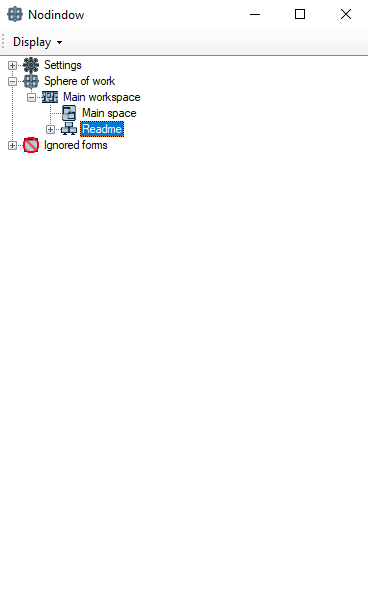

# Nodindow

## About
Nodindow is a tool designed to help users organize and manage application windows on their desktop efficiently, providing a more organized and productive environment.

## Watch the demo video

You can see the application demonstration video here:

**Link to video:** [Watch the demonstration video](https://www.youtube.com/watch?v=QsxQkTQM99g)

## Organize your desktop with Nodindow

If you have many applications open and want an efficient way to organize your desktop, Nodindow is the perfect solution for you! It was developed to help keep your work environment cleaner and more organized.

+ What Nodindow can do for you:
    - Organize your windows: If you have several applications open and easily get lost between them, Nodindow can help you organize your windows in a practical and quick way.
    - Quick window switching: If your work requires agility to switch between different tasks and windows, Nodindow allows you to do this in a simplified way, with just one click.
    - Better productivity: With a more organized desktop, you can focus on what really matters, without wasting time trying to locate windows or applications.

Whether you want to organize your windows, improve navigation or simply gain more space on your screen, Nodindow is the tool you need to work more efficiently.

## How to use

Nodindow must be launched with all applications closed. Only after it is opened will the user be able to start the
programs they want to use. Nodindow will only be able to manage and manipulate windows that were opened after its
startup. Any window that was already open before Nodindow was launched will not be recognized or controlled by the
system, unless the user moves the specific application from the ignore forms list to the working sphere.

The space node handles all windows within it without distinguishing between monitors. The spacePerScreen node organizes
the windows by separating them by monitor, allowing the space of each monitor to be manipulated individually by the
user. The user can control a specific monitor by moving the mouse cursor to the desired monitor and then move forward
or backward in space using the hotkeys (Ctrl + Up and Ctrl + Down), which only affect the monitor where the mouse
cursor is located.

To switch between different spaces or spacePerScreen, the user can use the hotkeys (Ctrl + Right and Ctrl + Left). To
hide or show an application, the default hotkey is Ctrl + Home.

The names of the monitors can be modified in the Settings/Monitors section. The changes will be applied globally to
new nodes.

## Installation

### Follow the steps below
+ Download the latest version of Nodindow from [Releases](https://github.com/ThalysoncamposTh/Nodindow/releases/).
    - Download the installer file (.exe).
    - Run the downloaded file and follow the installer instructions.
    - Enjoy Nodindow!

## Contributing
### suggestions for improvements
Contact me via Gmail: nodindow.dev@gmail.com

### Fork and clone your repository
1. Fork the repository (click here to fork now)
2. Clone your forked code git clone https://github.com/ThalysoncamposTh/Nodindow.git
3. Create a new branch
4. Push your commits
5. Submit a new Pull Request

### Ways to Contribute
#### Translation
We want Nodindow to be accessible to as many people as possible. If you speak another language, please help us by translating Nodindow into new languages ​​or improving existing translations.

#### Code
Nodindow is developed in C# with Windows Forms. If you have experience with these technologies and want to contribute, there are several ways to help, such as:

1. Bug fixing: Identify and fix problems in the code.
2. Performance optimization: Improve efficiency and reduce resource consumption.
3. Interface Enhancement: Improve user experience and usability.
4. New features: Implement features that make Nodindow even more useful.
Feel free to explore the repository, suggest improvements, and submit pull requests!

### Technologies Used

+ Google.Cloud.Translation: Google Cloud library for text translation. Used to provide translation functionality in the project, allowing Nodindow to be accessible in multiple languages.

+ LiteBD: database-level library. Used to manage data within Nodindow, it provides fast and simple storage for the application without the need for a complex database system.

+ Newtonsoft.Json: One of the most popular libraries for JSON manipulation in .NET. Used to facilitate the serialization and deserialization of JSON objects, essential for data communication within the application.

### Environment variables
The translationTools project is used to translate Nodindow texts. It uses the Google.Cloud.Translation.V2 library to perform automatic translations.
#### Google Cloud API Configuration
To use translationTools and generate automatic translations, you must configure the Google Cloud API key in the Windows environment variables. Follow the steps below:

1. Create a project in the Google Cloud Console.
2. Enable the Google Cloud Translation API.
3. Generate the API key in the credentials panel.
4. Add the API key as an environment variable in Windows:
5. Variable name: GOOGLE_CLOUD_API_KEY
6. Variable value: "sua_api_key_aqui"
+ How to configure the environment variable in Windows:
    1. Open the Start Menu and search for "Environment Variables".
    2. Select "Edit system environment variables".
    3. In the advanced field, click on Environment Variables.
    4. In the "System Variables" section, click "New...".
    5. In the Variable name field, enter GOOGLE_CLOUD_API_KEY.
    6. In the Variable value field, enter the API key that you generated in Google Cloud.
    7. Click OK to save.

After that, translationTools will be configured to use the Google Cloud API key for automatic translations.

## 💖 Support this project
Nodindow is an open source project developed with dedication. If you like the project and want to support my work as a developer, please consider making a donation.

Contributions help keep the project active and also allow me to dedicate more time to its development.

☕ How to support

If you want to contribute financially, you can do so through:

[GitHub Sponsors](https://github.com/sponsors/ThalysoncamposTh)

Every contribution, regardless of the amount, makes a difference. Thank you for your support! 🚀

## License

This project is licensed under the terms of the [GNU General Public License v3.0](./LICENSE.txt).  

© 2025 Thalyson da Silva Campos.  

This software is open source and may be copied, modified, and distributed under the terms of GPL-3.0.  
For more details, see the [`LICENSE`](./LICENSE.txt) file.
